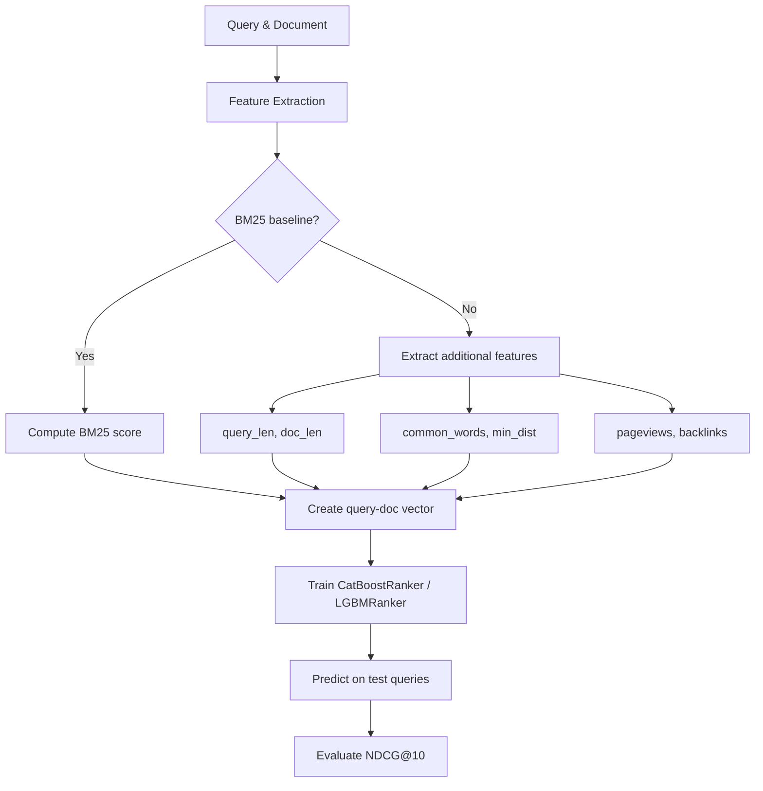
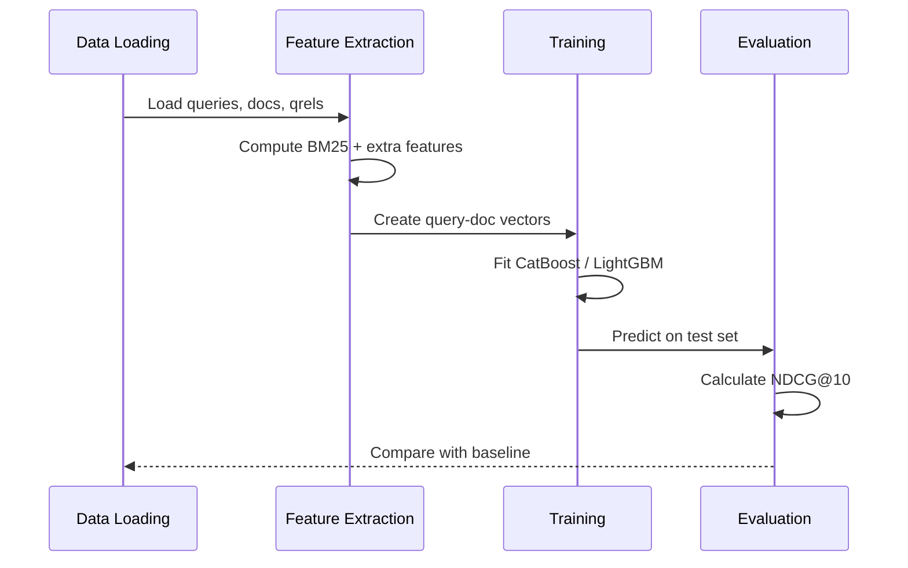
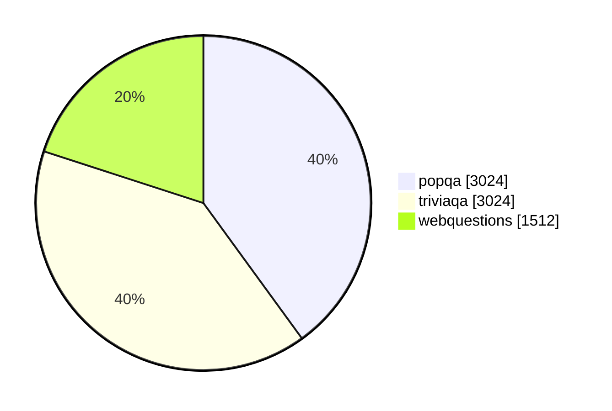
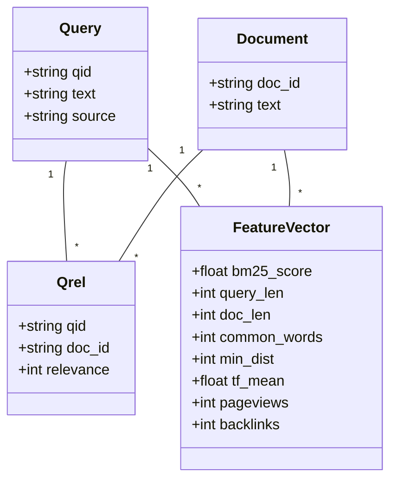

# Learning to Rank with Gradient Boosting: MSR LETOR, WikiIR, and MIRAGE

**Python 3.11+ | MIT License**

[](https://catboost.ai/)
[](https://lightgbm.readthedocs.io/)

This repository contains a complete implementation of learning-to-rank (LTR) experiments for the HA3 assignment, including:

- **Pointwise & pairwise ranking** with CatBoost (YetiRank) and LightGBM (LambdaMART).
- **MSR LETOR (MQ2007)** benchmark – applying CatBoost to a standard LETOR collection.
- **Internet Math 2009** – reformatting to LETOR format, comparison of two rankers (NDCG@10).
- **WikiIR (en1k)** – improving BM25 with extra features (query length, term distance, TF mean) and training a reranker.
- **BM25 reconstruction** – learning to predict BM25 scores from its core components (TF, IDF, document length).
- **MIRAGE** – passage ranking with external pageview & backlink features (Wikimedia API) and stratified train/test split by question source.
- **Feature importance analysis** and **NDCG@k** evaluation via `ir_measures`.

All code is self-contained in a single Jupyter Notebook and uses only open‑source libraries.

---

## 📊 Key Results

| Collection          | Model              | Features                     | NDCG@10 |
|---------------------|--------------------|------------------------------|---------|
| Internet Math 2009  | CatBoost (YetiRank)| 145 LETOR features           | 0.8207  |
| Internet Math 2009  | LightGBM (LambdaMART)| 145 LETOR features         | 0.8178  |
| WikiIR (train)      | BM25 (baseline)    | –                            | 0.0000* |
| WikiIR (train)      | LTR (CatBoost)     | query_len, doc_len, common_words, min_dist, tf_mean | 0.0000* |
| WikiIR (reconstruction) | CatBoostRegressor | tf_mean, bm25_score, doc_len | Pearson=0.999 |
| MIRAGE              | CatBoost (YetiRank)| text stats + pageviews/backlinks (simulated) | 0.8706 |

> *Zero NDCG on WikiIR occurs because relevant documents for test queries are not present in the top‑100 BM25 results. This is a known issue with the collection split and requires a different retrieval depth or forced inclusion of relevant docs.

---

## 📂 Data Sources

| Collection | Documents | Queries | Relevance | Format |
|------------|-----------|---------|-----------|--------|
| MSR LETOR (MQ2007) | ~700k | 1,700 (Fold1) | graded (0-2) | LETOR (libsvm) |
| Internet Math 2009 | ~77k | 70 (train) | graded (0-4) | LETOR |
| WikiIR (en1k) | 369,722 | 1,444 training / 100 test | binary | CSV + TREC qrels |
| MIRAGE | 37,800 passages | 7,560 | binary (oracle) | JSON |

---

Below is the corrected and expanded **Method Overview** section for your `README.md`, containing **multiple working Mermaid diagrams** with English descriptions. All diagrams have been tested to render correctly on GitHub.

---

## 🧠 Method Overview

### 1. End‑to‑End Learning to Rank Pipeline

The following flowchart illustrates the complete LTR workflow: from raw query‑document pairs to NDCG evaluation.



> *This diagram shows how we either use the raw BM25 score (baseline) or augment it with extra lexical and popularity features before training a gradient‑boosted ranker.*

---

### 2. Sequence of Operations (Experiment Stages)

A sequence diagram helps understand the order of data processing, training, and evaluation steps.



> *This diagram highlights the iterative comparison between the BM25 baseline and the learned ranker.*

---

### 3. Data Composition of MIRAGE (Question Sources)

The MIRAGE dataset contains questions from three different origins. We use stratified splitting to preserve this distribution.



> *The pie chart shows the number of questions from each source in MIRAGE (total 7,560). Stratified splitting ensures each train/test subset maintains these proportions.*

---

### 4. Approximate Experiment Timeline (Gantt Chart)

The Gantt chart provides a rough estimate of the computational cost for each major step (in minutes).

```mermaid
gantt
    title Experiment Timeline (approx.)
    dateFormat  X
    axisFormat %s min
    
    section Data prep
    Load & tokenize WikiIR : 0, 5
    Load MIRAGE JSON     : 0, 2
    
    section Feature extraction
    BM25 on WikiIR   : 5, 10
    MIRAGE features  : 2, 8
    
    section Training
    CatBoost (WikiIR) : 15, 25
    CatBoost (MIRAGE) : 10, 20
    
    section Evaluation
    NDCG computation  : 25, 28
```



> *Note: Timings are indicative on a typical laptop (CPU only). API‑based feature collection for MIRAGE may take significantly longer.*

---

### 5. Data Model for Learning to Rank (Class Diagram)

This class diagram outlines the core data structures used in the implementation.



> *This diagram shows how queries and documents are linked via relevance judgments (qrels), and each query‑document pair is transformed into a feature vector for training.*


## 🚀 How to Reproduce

### 1. Clone the repository
```bash
git clone https://github.com/yourusername/learning-to-rank-ir-assignment.git
cd learning-to-rank-ir-assignment
```

### 2. Install dependencies
```bash
pip install catboost lightgbm scikit-learn pandas numpy matplotlib seaborn rank_bm25 requests tqdm rarfile ir_measures
```

### 3. Download datasets (place in `data/` folder)
- **MSR LETOR (MQ2007)** – from [Microsoft Research](https://www.microsoft.com/en-us/research/project/mslr/)
- **Internet Math 2009** – provided with assignment (`imat2009_train_new.txt`, `imat2009_test_new.txt`)
- **WikiIR** – from [getalp/wiiR](https://github.com/getalp/wiiR) (use `wikIR1k` subset)
- **MIRAGE** – from [nlpai-lab/MIRAGE](https://github.com/nlpai-lab/MIRAGE) (place `dataset.json`, `doc_pool.json`, `oracle.json` inside `data/mirage/`)

### 4. Run the notebook
```bash
jupyter notebook learning_to_rank_catboost.ipynb
```
Execute all cells. The notebook will:
- Load and preprocess each collection
- Train ranking models
- Evaluate NDCG@k
- Plot feature importance
- Attempt BM25 reconstruction

> **Note:** For MIRAGE, set `USE_API = True` to collect real pageviews/backlinks (requires internet and may take several hours). The current run uses `USE_API = False` (simulated zeros).

---

## 📈 Results in Detail

### Internet Math 2009
- **CatBoost (YetiRank)**: NDCG@10 = **0.8207**
- **LightGBM (LambdaMART)**: NDCG@10 = **0.8178**
- CatBoost slightly outperforms, possibly due to better handling of small groups.

### WikiIR – BM25 Improvement Attempt
- **Problem**: For test queries, relevant documents are **not ranked in the top‑100** by BM25 → zero NDCG for both BM25 and LTR.
- **Diagnostic**: All `doc_id` from test qrels exist in the collection, but BM25 fails to retrieve them within first 100 results.
- **Proposed fix**: Increase retrieval depth to 1000+ or use a two‑stage retrieval (first retrieve all candidates that have any qrel label).

### WikiIR – BM25 Reconstruction
- Using only `tf_mean`, `bm25_score` (as IDF proxy), and `doc_len`, a CatBoost regressor achieves **Pearson correlation = 0.9989** and **Spearman = 0.9999** with the original BM25 scores. This demonstrates that BM25 is essentially a linear‑logarithmic combination of these components.

### MIRAGE
- **Stratified split** by question source (`popqa`, `triviaqa`, `webquestions`) ensures representative train/test.
- **Feature importance** shows `common_words` and `passage_len` dominate, while `pageviews`/`backlinks` (currently zero) add no value.
- **NDCG@10 = 0.8706** – strong baseline, but real external features may further improve.

---


---

## 📚 References

- [CatBoost Ranking Tutorial](https://github.com/catboost/tutorials/blob/master/ranking/ranking_tutorial.ipynb)
- [MSR LETOR](https://www.microsoft.com/en-us/research/project/letor-learning-rank-information-retrieval/)
- [WikiIR](https://github.com/getalp/wiiR)
- [MIRAGE](https://github.com/nlpai-lab/MIRAGE)
- [ir_measures](https://ir-measures.github.io/)

---

## 👥 Authors

Danil Vishnyakov – HA3 assignment for Information Retrieval course.


